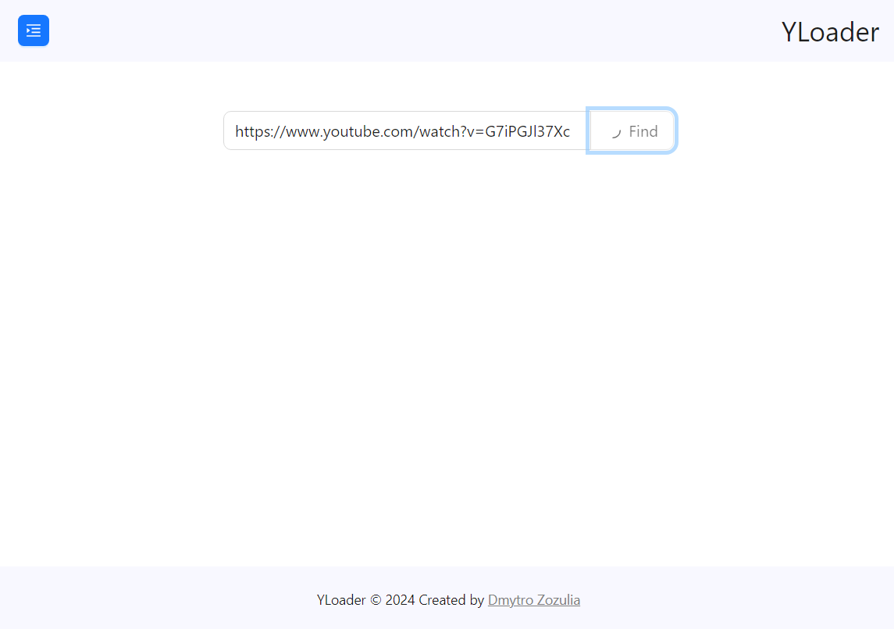
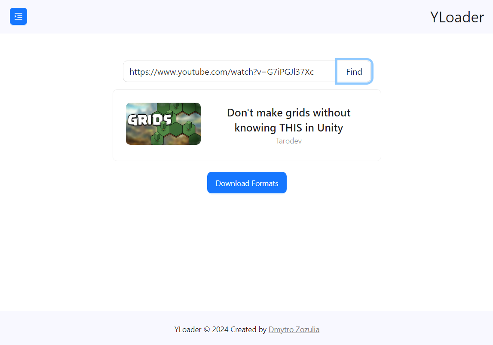
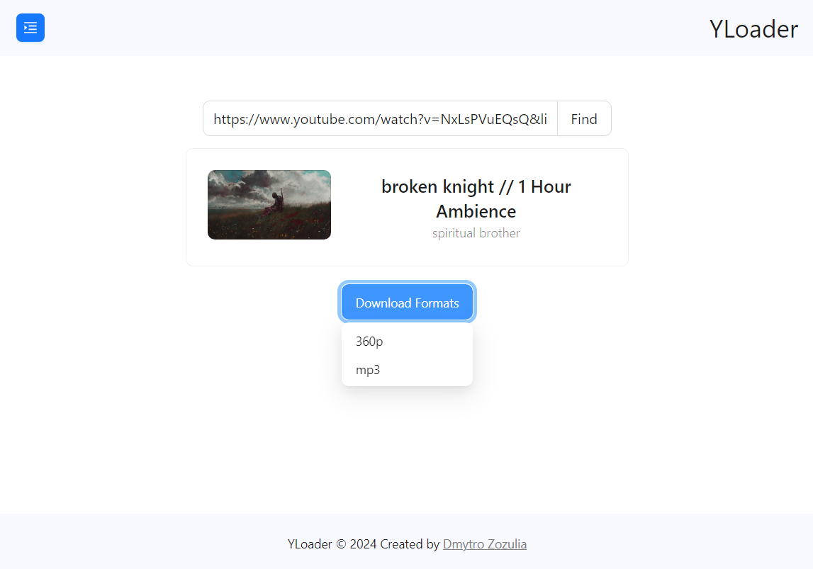
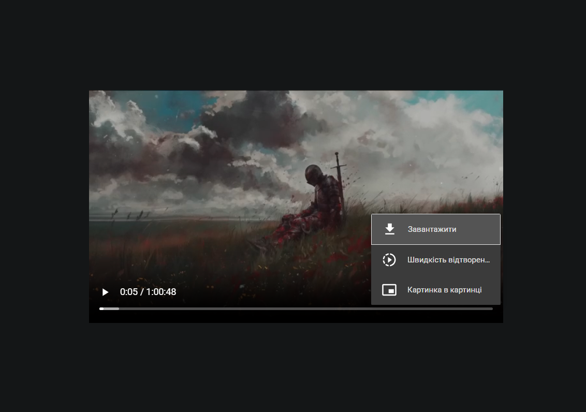
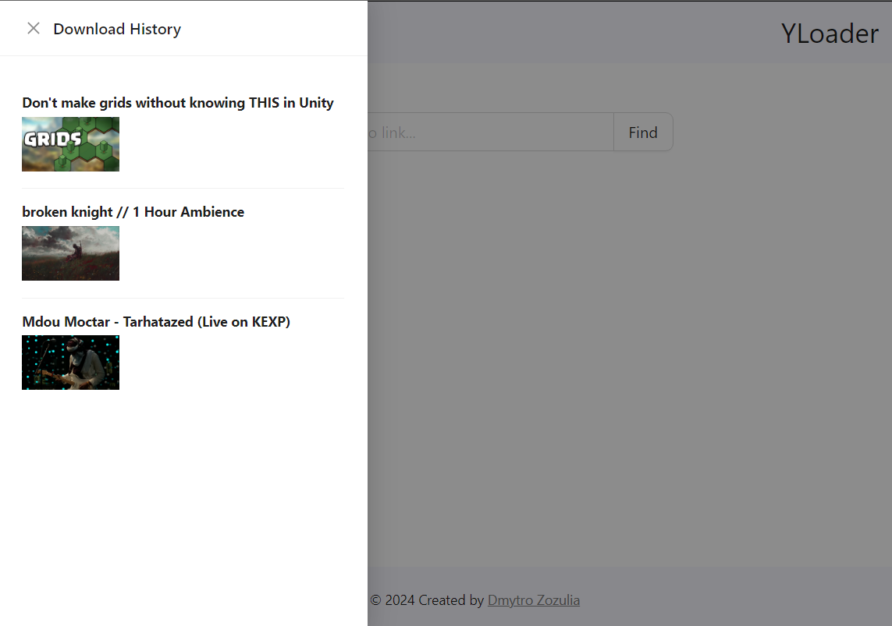

# YLoader

YLoader is a simple downloader for YouTube videos. Enter a link to download a raw video or audio file.

## Backend

- API is built with .NET (C#).
- [YouTube Explode](https://github.com/Tyrrrz/YoutubeExplode) is used for accessing videos data, such as: title, images, download links, etc.
- [MediatR](https://github.com/jbogard/MediatR) is used to make the backend architecture a bit cleaner and easier.

## Frontend

- The client side is built using React (TypeScript).
- Vite is used for the local server.
- [MobX](https://mobx.js.org/README.html) is used for state management.
- [Ant Design](https://ant.design/components/overview/) is used for UI.
- [Axios](https://axios-http.com/docs/intro) is used to fetch data from the API.

## Code and Features

Here are some features you might be looking for:

- [Getting video details (title, image etc)](https://github.com/Dizmo3377/yloader/blob/main/Application/Youtube/Details.cs).
- [YouTube MobX store](https://github.com/Dizmo3377/yloader/blob/main/client/src/app/stores/youtubeStore.ts).
- [Link input component](https://github.com/Dizmo3377/yloader/blob/main/client/src/components/LinkInput.tsx)
- [Getting data from the API](https://github.com/Dizmo3377/yloader/blob/main/client/src/app/api/agent.ts)
- And more!

## Screenshots

## Thanks!

I really appreciate you taking the time to check the code! This project is just a showcase of my programming skills and knowledge. It is not intended for commercial use or monetization, but rather for learning purposes. If you have any questions or would like to contact me, please feel free to [reach out](https://linktr.ee/DizmoProd).
